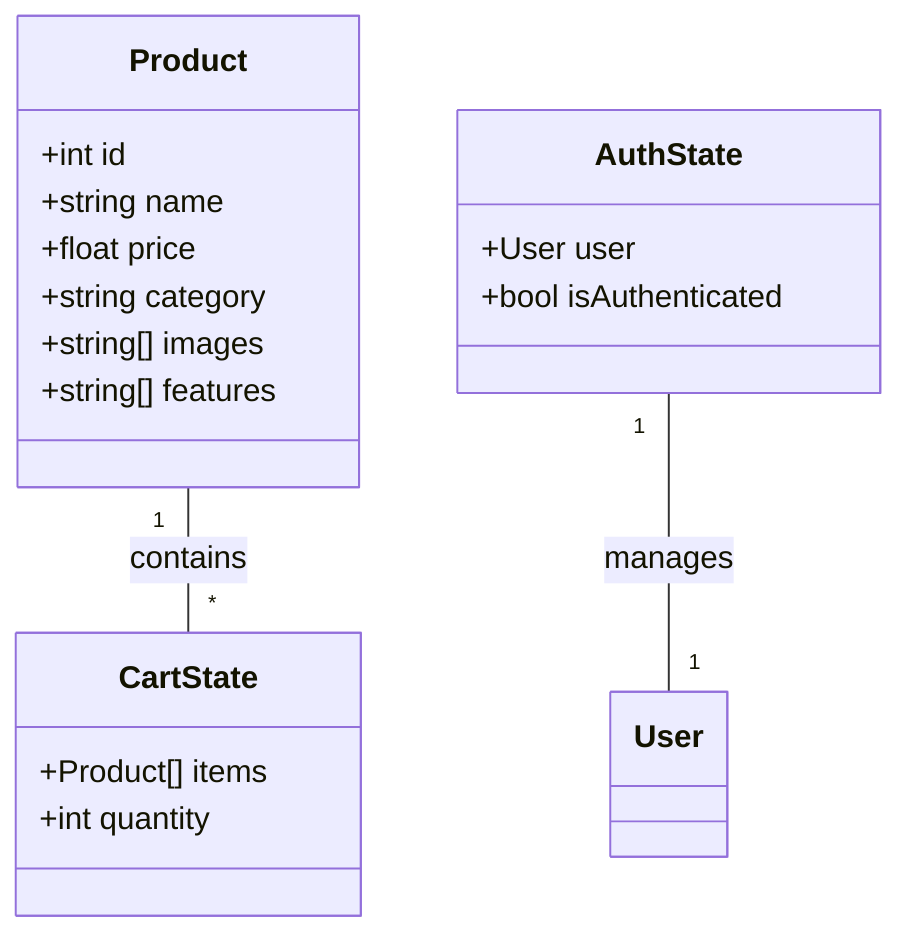

# TechArmy Engineering Documentation: Diagrams & SDLC

---

## 1. SDLC Methodology

**Method Followed:** Agile (Iterative Development)

**Phases:**
- Requirements Gathering
- Planning & Design
- Implementation (Development)
- Testing
- Deployment
- Maintenance & Iteration

**SDLC Flow Diagram:**
```
[Requirements] → [Planning] → [Design] → [Development] → [Testing] → [Deployment] → [Maintenance]
```

---

## 2. System Architecture Diagram

**Components:**
- Client (React + Vite)
- State Management (Redux Toolkit)
- Data Layer (Static data, ready for API integration)
- UI Layer (Tailwind CSS, Swiper, React Icons)
- Routing (React Router DOM)

**Diagram:**
```
[User]
   |
[Browser]
   |
[React App]
   |---[Pages]
   |---[Components]
   |---[Redux Store]
   |---[Static Data]
   |---[Routing]
```

---

## 3. Class Diagram (Simplified)

**Main Classes/Types:**
- Product
- CategoryItem
- MenuItem
- NavItem
- CartState
- AuthState

**Diagram:**
```
Product
 ├─ id: number
 ├─ name: string
 ├─ price: number
 ├─ category: string
 ├─ ...

CategoryItem
 ├─ title: string
 ├─ icon: string
 ├─ href: string

MenuItem
 ├─ label: string
 ├─ href: string
 ├─ children: MenuItem[]

NavItem
 ├─ name: string
 ├─ path: string
 ├─ subItems: NavItem[]

CartState
 ├─ items: Product[]
 ├─ quantity: number

AuthState
 ├─ user: User | null
 ├─ isAuthenticated: boolean
```

---

## 4. Component Flowchart

**Example: Cart Flow**
```
[ProductCard] --(Add to Cart)--> [Redux: cartSlice] --(Update State)--> [CartSidebar] --(Display Cart Items)
```

**Example: Page Navigation**
```
[Navbar] --(User Click)--> [React Router] --(Route Change)--> [Page Component]
```

---

## 5. Formal Documentation Planning

- **Requirements Specification:** List all functional and non-functional requirements.
- **Design Specification:** Include wireframes, UI mockups, and architecture diagrams.
- **Implementation Plan:** Detail the development phases, milestones, and responsibilities.
- **Testing Plan:** Describe unit, integration, and user acceptance testing.
- **Deployment Plan:** Steps for building, previewing, and deploying the app.
- **Maintenance Plan:** Outline for future updates, bug fixes, and feature additions.

---

## 6. Tools for Diagram Creation

- **Draw.io / diagrams.net:** For architecture, flowcharts, and class diagrams.
- **Lucidchart / Creately:** For professional engineering diagrams.
- **Mermaid.js:** For markdown-based diagrams (can be embedded in docs).

---

## 7. Example Mermaid Diagram (Class Diagram)



---

Let me know if you want these diagrams generated as image files, embedded in markdown, or need help with a specific diagram or documentation section!
